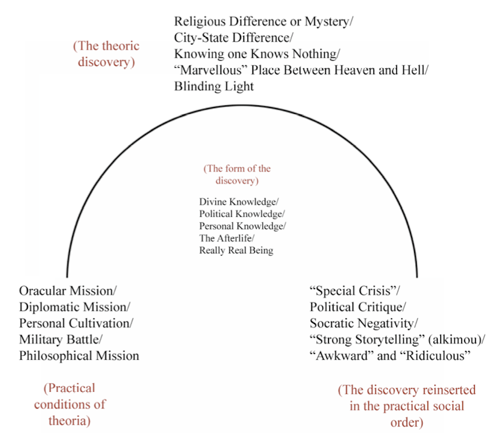
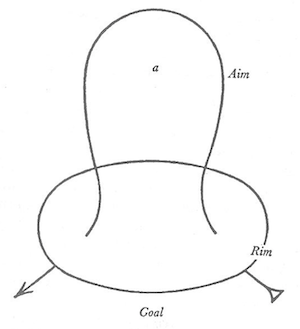
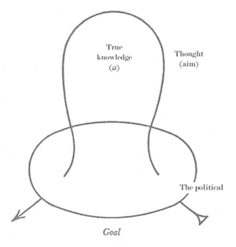

 
## What Does It Mean to Make-Up the Mind (οὕτω διανοεῖσθε)?

Under what conditions can thought and speech participate meaningfully in systemic political transformations? In my view, two bodies of late twentieth-century thought stand out as the most advanced efforts to answer this question. Gilles Deleuze and Michel Foucault, in their own registers and of course with very different accents, both suggest substantial but complicated roles thinking and speaking might have to play in any viable future project of emancipatory politics. Given the idealistic associations and connotations of such terms as thinking and speaking, it is no surprise that both figures have been charged with similar crimes: dandyism, individualism, or escapism, all of which are typically implied to render their bodies of work unhelpful for projects of organized, collective political change.

Indeed, in the present historical moment, the so-called age of information, we are now in a better position than ever to understand the ways in which mere thought and speech are unable to generate politically significant emancipatory dynamics. In modern global capitalism, it has never seemed more clear that what is called freedom of speech and the public exchange of ideas is perfectly consistent with the perpetuity and even intensification of oppressive institutional dynamics. Yet, I wish to suggest that in this rightful disillusionment with mere thought and speech lies an opportunity for increased clarity with respect to the unique conditions under which a more rigorously understood form of radical truth-telling may not only be politically effective but perhaps the sine qua non of emancipatory political activity today, in the context of what Deleuze called “control societies.”

If it is true that Foucault and Deleuze are two of the most advanced thinkers of this question—and yet even they remain uncleared of charges relating to political triviality—then it would seem that the surest way to advance the question would be to begin at the outermost edges of where they left off. While Deleuze and Foucault will help to motivate the problem, I will turn elsewhere for the materials that I believe can provide the most compelling solution to this puzzle at the edge of their works.

As Foucault’s references suggest, the peculiar and conditional, but radical political power of thought and speech is a motivating concern in some of the founding discourses of Western political thought. The largest portion of this study is therefore dedicated to Plato’s Republic, because it is in that most strange text that I believe this question receives one of its most impressive treatments, but one which remains only partially understood. Additionally, as Foucault and Deleuze both constructed their works to some degree against the foil of psychonalysis, it will not be too surprising that psychoanalysis emerges as a natural frame for formalizing how and why thought and speech are typically pacified into consistency with political orders.

In the very beginning of the Republic, Polemarchus says to Socrates and Glaucon that he simply will not listen and that they “better make up [their] mind to that" (οὕτω διανοεῖσθε). What could it mean to “make up one’s mind” to the fact that one will not be heard? Drawing on the history of ancient Greek religious practices and Lacan's topological, diagrammatic heuristics for his theory of the drive, I demonstrate how the Republic offers a remarkable solution to the problem of how to think and speak in contexts where political factors may doom one not to be heard. In particular, I extend Lacan’s diagrammatic heuristics to show that what is called knowledge is a product of a circular process in which free thought immanently emerges from, and returns to, brute political forces. As we will see, this perverse circularity is also explicit in the work of Foucault and Deleuze. True knowledge then lies in comprehension of this form that obtains between free thought and the political factors that at once require but also taint or even prohibit free thought.

In the end, the first contribution of this study will be to show how and why mere thought and speech, even true speech, is typically doomed to political impotence. The key problem, in short, is that where power is unequally distributed, the dominant can always choose not to listen. While this may seem obvious, conventional notions about the roles of free thinking and free speaking in creating social transformation become mystified to a degree that remains underestimated. What is called free, critical, or oppositional thought and speech typically coincides with the status quo to a greater degree and on a deeper level than is widely believed.

The second and main contribution will be a possible or at least partial solution to the puzzle. The line of thought elaborated here suggests that the solution involves tactically variable deployments of *parrhesia*—truth-telling or frank speech (*franc-parler*)—which, if undertaken correctly, have the unique properties of being indecipherable to the dominant and irresistably, non-communicatively generative of autonomous collective power. It turns out that the dominant do dig their own graves, not by creating an impoverished industrial proletariat, but because their cultivated aural numbness renders them helpless when their mechanisms of control are discovered by the the subjects who learn their contributions to dialogue are falling on deaf ears. Instead, subjects become revolutionary when they learn how to “make up their mind” about this.

The tactical manuevers Foucault discusses under the heading of “courage” are the same ones that “make up the mind,” in the sense that courage involves an openness to real objective forces which are the only forces that can attune diverse mental processes of dominated individualized bodies into shared movements toward liberation (the mind here being shaped or “made” by objective forces), but also in the sense of creatively altering the political reality through performances that issue from those mental processes. These types of operations are typically invoked as examples of faux-radical dandyism or individualistic, bourgeois “lifestyle politics” but the analysis shows that, on the contrary, these are operations of what Deleuze calls “nomadic science,” or the only empirically serious way that currently atomized bodies can even begin to enter into collective processes capable of transforming institutions that operate at population level.

The confusion that underwrites accusations of political triviality is that such operations *should* genuinely appear ridiculous and trivial in the first analysis, when seen through pacified eyes in the creative stirrings of others with whom one shares no affective bonds. My analysis will help us to see that such accusations are better understood as examples of precisely the mechanism whereby political orders neutralize oppositional thought and speech. Such accusations are the prevailing body politic defending itself through the bodies of those who, for whatever reason, simply cannot hear the non-communicative refrains of those bodies immersed in dynamics of liberation. If a political aesthetics of existence *appears* to be so many politically trivial flights of the ego, the theoretically and politically appropriate response is to *let it appear as such.* Those who allow themselves to be swept away by real micro-political dynamics of liberation will know their empirical effectiveness, and whoever remains so doggedly invested in such conservative operations as signifying, interpreting, or objecting, then it is no surprise, and no problem at all, that such people will not see when others are becoming revolutionary right in front of their eyes.

## “But could you persuade us, if we won’t listen?”

In one of his later lectures, published as “The Courage of Truth,” Foucault is interested in the conditions under which, in ancient Greek culture, an act of truth-telling would or would not come to be recognized as such by a speaker or listener. Foucault is clear that he is not so interested in the the discursive or logical structures that make something recognizable as true, but the interpersonal and performative conditions that allow someone to function as a subject telling the truth. He notes a few key conditions:

“In short, parrhe– sia, the act of truth, requires: first, the manifestation of a fundamental bond between the truth spoken and the thought of the person who spoke it; [second], a challenge to the bond between the two interlocutors (the person who speaks the truth and the person to whom this truth is addressed). Hence this new feature of parrhe– sia: it involves some form of courage, the minimal form of which consists in the parrhesiast taking the risk of breaking and ending the relationship to the other person which was precisely what made his discourse possible. In a way, the parrhesiast always risks undermining that relationship which is the condition of possibility of his discourse.“
 
While the listener can be anyone, for an act of truth-telling to take hold, the listener “must accept the game of parrhesia; they must play it themselves and recognize that they have to listen to the person who takes the risk of telling them the truth.“ (12) 

We can already see here the theoretical vulnerability of any politics based on an aesthetics of existence: any politics contingent on even the attention of others, let alone a cooperative attention, could be accused of wistfully begging precisely what is so difficult about politics, namely, how to proceed in the face of willfully non-attentive and/or non-cooperative others? It is therefore reasonable to wonder skeptically how Foucault’s subsequent elucidation of the workings of parrhesia could ever generate any useful, let alone radical or revolutionary, insights into how political situations defined by inequality and domination might ever be fundamentally altered in the direction of optimal collective flourishing. Quite the contrary, if the key conditions are not met, parrhesia can turn out very badly. Relevant to the analysis that follows this section, Foucault notes about the *Republic,* that Plato explicitly diagnoses “the bad democratic city, which is all motley, fragmented, and dispersed between different interests, passions, and individuals who do not agree with each other. This bad democratic city practices parrhesia: anyone can say anything.” (10)

Deleuze and Guattari are explicitly concerned with this same dilemma. In A Thousand Plateaus, they will repeatedly identify a certain pattern of political conservatism, which they will often associate with psychoanalysis: “Silence people, prevent them from speaking, and above all, when they do speak, pretend they haven't said a thing: the famous psychoanalytic neutrality.“ (TP, 8) Many of the conceptual personae in that book—the white wall of the signifier, the black hole of subjectivity, and the machine of faciality—are all variations on the theme of social technologies that channel, deflect, distort, or otherwise pacify potential becomings into the circuits that generate the life and consistency of the dominant social system. For Deleuze and Guattari, contemporary liberal democracy and the “paradox of the legislator-subject” is the apotheosis of this pattern: “the more you obey the statements of the dominant reality, the more in command you are as subject of enunciation in mental reality, for in the end you are only obeying yourself! You are the one in command, in your capacity as a rational being. A new form of slavery is invented, namely, being slave to oneself.” (TP 130) Just as we find in Foucault, at stake here is the problem that speech may be perfectly free and not only fail to have any political potency but even become the mystified lifeblood of the dominant social system one sets out to question, challenge, or transform.

Plato's Republic begins with a curious staging of this problem. In the very beginning of Plato’s *Republic*, Glaucon and Socrates are heading home to Athens. Polemarchus sees them from a distance and sends a slave to stop them.[^1] When Polemarchus catches up, he has Adeimantus, Niceratus, and others by
his side. Very abruptly, Polemarchus points out that he has more men in his group, and that Glaucon and Socrates must
therefore “prove stronger,” or will be forced to stay. Socrates asks if there is not a third possibility, namely, that
he and Glaucon persuade the others to let them pass. Polemarchus poses the counter-question: “But could you persuade us,
if we won’t listen?” to which Glaucon replies, “Certainly not.” Polemarchus closes this discussion with an extremely
enigmatic statement: “Well, we won’t listen; you’d better make up your mind to that” (οὕτω διανοεῖσθε).[^2] Immediately
after, Adeimantus describes the enjoyments they can expect that evening, “persuading” them to stay after they have
already been told they have no choice. Oὕτω διανοεῖσθε is a peculiar phrase. Οὕτω is an adverb, which means “in this
way,” and thus signifies a limitation of some kind, a restriction with an implicitly commanding or imperative dimension.
However, διανοεῖσθε is constructed in the optative mood and means “to be minded,” thus implying a free choice in the use
of the mind. It is a strange syntactical pairing of the proscriptive/prescriptive with the optative—it seems to suggest
a sort of forced freedom.

Furthermore, as if to redouble this tension semantically, διανοεῖσθε contains
νόος, mind—the mind of philosophy and understanding, of logical thought—but
begins with δια, a commonly used particle to denote necessity, the necessity of
something in need of doing. “In this way, you two will have to do with your
mind.” The mind will have to do.[^3] Thus, Plato’s language awkwardly combines,
on two different linguistic levels, the connotations of force and free thought.
As a result, none of the English renderings is immediately comprehensible for
us. For, what could it mean to “make up one’s mind” to the fact that one will
not be heard? This does not link up clearly to any of the multiple meanings that
for us are attached to the idea of “making up one’s mind.” However, this very
gap is heuristic: because this current expression conserves quite clearly the
contradictory construction of διανοεῖσθε and at the same time is essentially
incomprehensible in the context of the *Republic*, this provides the roadmap of
a certain distance—a resistance, if one pleases—that would need to be traversed
to bring this small piece of Plato’s thought into mutual illumination with our
own. This being the present aim, a brief justification may be in order. Will the
exegesis not be disproportionately extensive with respect to this passing remark
in what is not yet even the substantive dialogue?

First, one must be immediately struck by the quite sudden and apparently
arbitrary politicization this exchange represents. Especially because Adeimantus
is Glaucon’s brother, the introduction of the question of force here seems
rather contrived. One might read the inorganicism of this question’s appearance
as an indication that something important must be addressed straightaway, a
sacrifice of organic narrativity which must serve another function. Second,
beyond this vague hint, in some sense the whole subsequent dialogue has this
injunction to “make up one’s mind” as its very condition of possibility and can
be read as responding to its call, because otherwise Glaucon and Socrates would
have simply returned home never encountering the conditions for the production
of the *Republic*’s ideas. My reading seeks to confirm that both the
inorganicism and early placement of this seemingly unnecessary and merely
rhetorical prelude are both called for by the very argument that this scenario
dramatizes.

## The Circularity Problem

Jacques Lacan writes the following:

> I maintain that it is at the level of analysis—if we can take a few more steps
forward— that the nodal point by which the pulsation of the unconscious is
linked to sexual reality must be revealed. This nodal point is called desire,
and the theoretical elaboration that I have pursued in recent years will show
you through each stage of clinical experience, how desire is situated in
dependence on demand—which, by being articulated in signifiers, leaves a
metonymic remainder that runs under it, an element that is not indeterminate,
which is a condition both, absolute and unapprehensible, an element necessarily
lacking, unsatisfied, impossible, misconstrued, an element that is called
desire.[^4]
 
Instead of trying to unpack this systematically—Lacan is not our focus--let us rather
take it as an epigram, a provocation, a bank of vocabulary. A demand is an
injunction directed to another, and as a receipt or claim on the desire of the
other, it seems quite clear from the beginning that the psychic economy of an
individual understood in this way locates the individual in a social scenario
that is irreducibly political- economic. That is, if desire only functions in
dependence on demand, the economy of desire between persons is an economy of
scarcity, based as it is on individuals who, as speaking beings, cannot say
everything at once and must therefore make distributional decisions in speech,
but who are also players in a zero-sum game insofar as desires between persons
simply conflict. What a subject will articulate/signify is a choice always made
with respect to the aims of a desire among other conceivable desires and is
therefore always the function of a particular distribution of energy among other
alternative and forsaken distributions: a political decision. But the absolute
and also inapprehensible metonymic remainder of the subject’s articulations
introduce a second site of psychic politics: the inescapable condition of
articulation is the dissimulation or repression of the very basic, primordial
violence of language’s entrance onto the scene.

One would never get around to venturing the primordial word if one waited for
permission, a justification, a reason-in-advance of reason. The commonplace
dialectical paradox of political theory, that the state is logically and
empirically founded on the criminal act of its institution—logically because the
founding act is external to the state’s laws which are only established after
the fact, and often semi-empirically, for example, with Romulus’s legendary
murder and the founding of Rome—finds a perfect parallel in language, or what I
would like to call very broadly the theoretical as such (to accent the basic
continuity between high theory and everyday practices of signification.) The
theoretical is founded on a homologous primordial violence and continues through
a homologous repression/dissimulation of that violence. In other words, not only
does desire imply forsaken desires, but as speaking beings our articulations
imply one of the politician’s greatest pastimes: the “cover- up,” in which an
action that appears at the time practically necessary and desirable but
theoretically (or legally) objectionable demands further objectionable actions
to keep off the surface the original criminal act and also sustain the desirable
practical necessity. We continue to speak to cover up the unsatisfied,
impossible, unapprehensible lack which motivated our first utterance.[^5]

In politics, we endure while continually revising our management of the profits
and losses incurred in the primal political scene by new innovations in the
status quo (small to large killings of the father, from mundane legislation to
revolutions) and we enjoy their successes and atone for their failures in a way
that dissimulates their reality no less than primitives and neurotics. In the
theoretical, we find the same structure. The history of the theoretical is a
history of the management of a theoretical ambivalence, between the enjoyments
and gains made possible only with the pre-theoretical breach of articulation and
a moral consciousness we have become cognizant of only because of the original
cut into the world by signification. This, then, establishes in a very
preliminary way the basic coordinates of my interest in the *Republic*: the
political-economic character of both the personal and interpersonal management
of desire; the repressive dimension common to political action and theoretical
articulation (what we can now call, properly, the unconscious of each); in
general, a very basic structural homology between the political, the
theoretical, and the economy of desire.

When Polemarchus makes his odd suggestion/injunction, he evokes this whole set
of problems with remarkable efficiency. The root of διανοεῖσθε is διανοέοµαι,
which contains the well-known nous, and means "be minded of, purpose, or
intention."[^6] To be minded of: to have something in mind, but also to have the
mind forced by the object of attention into its attention. And, of course, this
is precisely what is going on between Polemarchus and Socrates. Socrates has to
make up his mind about Polemarchus, consider the situtation, play with it in his
mind theoretically, etc., but only because the desire of Polemarchus presses,
oppresses and we can even say represses that mind. Theory is both repressed and
repressing. It is repressed by the objects of its attention, the desire of the
other that is its calling and whatever its particular fascination might be, and
it is repressing because, in order to function as sound reason, it must keep off
the record the founding violence of its intellectually arbitrary distributive
choices (to privilege theorizing over doing something else, for instance) in its
logically arbitrary origination. That is, the mind cannot simply mind itself in
a pure movement of justified reason, just like a state cannot found itself in a
pure movement of already legal legislation.

This is what explains Plato’s paradoxical construction, which suggests a forced
“making” or doing of the free mind. Plato is pointing us toward theory’s
obscene, and from its own standpoint, absolutely intolerable condition of
possibility: that pure reason and truth are founded on a situation thoroughly
mediated by an interpersonal negotiation of desire, i.e. the free-thinking mind
of philosophical thought is made possible by what, according to its own canons,
is a crime: a vulgar, practical necessity laced with selfish aims and opaque
strategies. And of course Plato’s own strategy in pointing this out to us is no
less opaque and must be achieved only by the most oblique condensation of
equivocal meanings. This is why it must not be objected against the present
reading that I am making too much ado about such a small and insignificant
portion of the text. If this little passage has been overlooked, it is no
wonder. For the text to get off the ground, it is necessary that it be
overlooked at first, only there to be reconsidered, at best, in ambiguous
hindsight. For, what it announces, if taken too far toward the limit of the
truth it hints at—the founding impurity of pure philosophical speculation which
shows its essential lie—would be the text’s own invalidation.

Thus, we can understand this initial scenario as a metatheoretical gloss on the
analogy between soul and city that is quite appropriately oblique, suspicious,
and dissimulated insofar as it cannot escape the economies of repression that
belong homologously to both the theory of politics and the politics of theory.
It is the metatheoretical statement of the *Republic* insofar as it comments, by
a remarkably multi-vocal dramatic enaction, on the originary and multi-
directional violence of philosophical thought. The homology between the
political management of psychic desire in speech (the theoretical) and socially
conflicting desires among individuals (the profanely political) can be
hypothesized as the justification for the analogy between the soul and the city.
We can now more confidently build on this analogy for developing the
implications of the homology between the politics of theory and the theory of
politics.

## The Structure of Theoria in the *Republic*

Andrea Wilson Nightingale has shown very well that Plato draws heavily on the
civic and religious traditions of theoria in order to constitute what is, at the
time the *Republic* is written, the new practice of philosophical theoria.[^7]
Indeed, she suggests that the *Republic*, of all dialogues, leans on traditional
social forms of theoria “especially clearly.”[^8] She observes that Socrates and
Glaucon, in the opening scenario, are returning from a “theoric event,” the
festival of Bendis. As she emphasizes, the establishing function of this theoric
event is tightly integrated into the text, particularly in its anticipation of
the metaphysical theoria developed in books V- VIII.

As a result of this debt to traditional forms of theoria, in Plato’s *Republic*
one can plot quite rigorously what I will call a “theoric structure.” In the
parallels between traditional forms of theoria and Plato’s philosophical
theoria, we have the material to sketch this structure and, particularly by
thinking more seriously about desire, put forward some quite significant
conclusions. To anticipate, this theoric structure consists in three elements:
1.) the desire for a particular kind of knowledge, which leads to 2.) a
confrontation with the object of that knowledge, and 3.) the problem of bringing
that knowledge back in the form a “return account.” This much is already clear
in accounts such as the one provided by Nightingale, but a few new points will
have to be brought into focus. Namely and in short, the theoric flight, although
it seeks knowledge or truth, takes off and lands on decidedly politicized
runways. The point of departure is invariably a function of competing desires,
and the return account is always compromised by the political reality of the
desires into which it must integrate itself. Furthermore, even in his
confrontation with the object of his theoric desire, it can be shown that the
theoros always comes up short or just misses his object. Finally and perhaps
most interestingly, we will have to note what is retained as the signifier of
this lost object.

In the case of religious theoria, the theoros is most often on an oracular
mission desiring, and himself a function of others’ desires for, divine
knowledge. The theoros is sent by a city to consult an oracle, perform the
relevant rituals, have the consultation,and return home to provide an account of
what was said by the oracle. Almost needless to say, the theoroi sent to oracles
were mostly from the aristocratic classes. More interestingly, the issue of
funding such theoric ventures were explicitly political. If not to an oracle, a
theoros might be sent to a religious festival for the same purpose, and with the
same expectations. As Nightingale notes, the latter form of religious theoria
was as political as it was religious, insofar as the theoroi were most often
aristocrats sent as representatives of their city.[^9] In this variation, we are
dealing with what is basically a diplomatic mission. As we will see, there is
another political dimension to this form of theoros in that the content of the
return account would by definition be a comparative political assessment of
one’s home city, favorable or unfavorable.

Even apart from an implicit political critique implied in a comparative view,
messages right from the mouth of an oracle could be a significant political
liability for the theoros, as in Oedipus Tyrannus.[^10] Part of the expectation
for oracular missions was a scrupulous emphasis on the faithfulness of the
return account, an insistence that one not “add anything,” nor “take anything
away,” from the “sacred pronouncement.”[^11] However, there are several
indications that this emphasis only testifies to the marked impossibility of
such a pure account. In fact, it is much like the dialectical paradox of the
rule and its transgression: the prohibition does not testify to the abhorrence
of a certain action, but an intimate sense of desire for its execution.

First, that the whole point of visiting an oracle is to bear witness to
something with one’s own eyes as opposed to just hearing an account,[^12]
already indicates an inherent inadequacy, an invariable gap in the completeness
of the most articulate return account. Secondly, oracular truth was never
something to be recorded and transmitted, but it rather consisted in a
ritualistic practice, what Elsner calls “ritual-centered visuality.”[^13] This
visuality supported by practical, ceremonial supports, keeps the theoros from
“interpreting images through the rules and desires of everyday life. It
constructs a ritual barrier to the identification and objectifications of the
screen of [social] discourse and posits a sacred possibility for vision.”[^14]
In this way, too, the divine vision is from the start not susceptible to a
faithful return account, insofar as the practical ritual conditions cannot be
simply replicated at home in a do-it-yourself manner. Finally, although
Nightingale cites the Ion for its rendering of what a return account looks like,
she does not notice the irony: in the excessively “vivid detail” of the chorus’s
description of the Oracle at Delphi, and also in the chorus’s comparison of the
Delphic sculptures to the ones with which they are familiar from home, can we
not see a note of mockery at the expectation, proffered by the likes of
Theognis, of an absolute fidelity in the return account?

In the case of theoria as a search for wisdom, the theoros undertakes the work
of personal cultivation to obtain a personal kind of knowledge or wisdom. The
theoros would journey abroad simply for the sake of learning. Through Herodotus,
Nightingale highlights Solon, who privately traveled abroad for ten years,
“wandering” in the name of “intellectual cultivation.”[^15] Instances of
personal self- cultivation with political sponsorship, it appears, are not
necessarily without religious and diplomatic dimensions.

Anarcharsis, interestingly, was sent to Greece by the king of Scythia and after
studying Greek religious practices, he attempted to introduce some of the Greek
religious practices into Scythian religious culture. The king of Scythia then
shot and killed him with an arrow for this attempted importation of foreign
ways, and the Scythian people then disclaimed all knowledge of Anacharsis.[^16]

The life of Socrates also followed the theoric trajectory as an instance of
personal theoria, distinct from the discipline of philosophy as Plato would
later conceive it. Socratic skepticism, which consists in knowing that one knows
nothing, was only a negative knowledge, a limiting knowledge used for the
maintenance of one’s own soul. Socrates’ practical efforts to provide an account
of what he learned were limited to extreme modesty and ironic detachment, and
critique of others’ claims and arguments. The benefit or gain of Socratic
dialectic was only to be found in Socrates’ inner peace, and it is well known
that his minor forays into practical conversion or positive intellectual
production, his “corrupting of the youth,” ended in dramatic political failure.

The Myth of Er, which concludes the *Republic*, follows the same structure. Er
participates in military battle as the practical access point to knowledge of
the afterlife. Plato narrates how Er is killed in battle, travels to the
afterlife, but then awakes to give an account of what he witnessed to the people
of his home city. The place of the afterlife, revealingly, is described
precisely as a religious festival, and there he is given an injunction to bring
home to mankind everything he witnesses there.[^17] When he entered the
afterlife, he was instructed to “listen to and look at everything in the place”
because he was to be a “messenger to human beings about the things that were
there.”[^18] However, just as in the other kinds of theoria, Plato in at least
two ways highlights that “everything in the place” is certainly not reported.

First of all, the sheer breadth and depth of what Er is given to perceive in the
afterlife almost leads one to think that what Er is perceiving is Everything
itself. That is, the fantastic ensemble Plato describes, between the notoriously
difficult “light and spindle” to the lives of men which are laid out (…all the
other things were there, mixed with each other and with wealth, poverty,
sickness, health, and to the states intermediate to them) seem to represent
nothing less than absolute totality plain and simple. If the experiential
content of Er’s visit to the afterlife is absolute totality itself, than Er’s
task of reporting “everything in the place” is like the “vivid detail” of the
*Ion*, an insistence on a completely comprehensive description of an experience
that is at the same time understood to be impossibly rich.

Secondly, one finds another peculiar statement in this portion of the text which
has the same functional significance of the narrative prelude which introduces
Socrates and Glaucon in the beginning of the text. Plato tells us that Er “said
some other things about the stillborn and those who had only lived for a short
time, but they’re not worth recounting.” Apparently, this is an absolutely
trivial statement. But we must be permitted to wonder: Why, if these things are
not worth recounting, is it worth it for Plato to recount that they are not
worth recounting? It seems perfectly fair to suggest that it is worth recounting
for Plato because it is in fact essential to recall that logos faces ineluctable
distributive choices, or in other words, that the giving of an account is
subject to an economy that cannot be ignored.

There is one final note of interest in the theoric structure of the myth of Er.
Socrates introduces the story with the following disclaimer. “It isn’t, however,
a tale of Alcinous that I’ll tell you but that of a brave Pamphylian man called
Er, the son of Armenias, who once died in a war.” As pointed out in the editor’s
notes, Plato seems to be punning on the Greek word for “brave,” alkimou. For,
the tales of Alcinous in Books 9-11 of the Odyssey are known as Alkinou
apologoi. Therefore, if alkimou can be read as combining alke (strength) and
nous (understanding), alkimou can be read as combining alke and Mousa, muse.
[^19] In other words, it is not a tale of strong logical understanding, but
rather a tale of strong storytelling. It is obvious that Plato, in recounting a
myth, is telling a strong story, and this is certainly what has served to
justify this particular interpretation of the pun.[^20] But because the figure
of Er, in Plato’s story, is also an assigned “messenger,” one can just as well
suggest that he, not Plato, is the strong storyteller. In fact, it is even more
compelling to understand Er as the object of the pun because the “brave”
(alkimou) character Plato refers to is, after all, Er, not Plato. Of course, we
will have every reason to affirm its applicability to Plato’s own recourse to
myth, but it is important for the purpose of rounding out the terms of the
theoric structure that we highlight the pun’s applicability to Er.

This distinction is noticeable and worth mentioning only in the present context
because the goal is to show that the applicability of the pun to Plato’s
mythmaking is not just an easy and obvious conclusion (“of course, Plato is just
telling a story,”) but rather the necessary conclusion of a deeper and more
systematic sketch of the theoric structure in its several appearances. That is
why it is necessary to highlight the structural integrity of Er’s theoric
trajectory, ending in the strong storytelling of his tale, rather than stopping
short at a reading of the pun which applies to Plato’s mythmaking only.

In Book V-VII of *Republic*, Plato constructs, for the first time at length, the
new, specific activity of “philosophy,” as something distinct from general
intellectual cultivation (philosophein).[^21] Nightingale shows in great detail
how the philosopher is constructed on the grounds of traditional theoria. The
Allegory of the Cave, for instance, is the story of a theoric pilgrimage from
shadow to light and back into shadow. The desire of he who leaves the cave
differs from mere personal cultivation in that the philosophical theoros seeks
not to “wander” so as to work on the self, but to see being as it really is, to
see it in its truth unadulterated by the shadows of personal desires, biases,
illusions, etc., in order to bring it back into the cave.[^22] This would be the
difference between wisdom and philosophical truth: the first is negative, a
peeling away of excesses, biases, and illusions for the improvement of one’s
soul; the second is a positive acquisition or production intended for the
reception of others. The error of Anarchasis, or Socrates for that matter, was
to make a politically inept production of their acquired wisdom. As we will see,
this also marks the difference between Socrates and Plato and can be read as a
foundational concern of the *Republic* itself.

## Formalizing the Structure of Theoria

If we wished to represent the structure of theoria graphically, as Plato gave us
to understand it, we would have to show thought "ascending" from earthly
obviousness to a better-lit plateau, followed by the descent back “down to
earth,” to “reality.” Here, each particular element in each particular kind of
theoria—Plato’s own as they appear on the narrative level of his text, and the
traditional institutions of theoria as Nightingale has reconstructed them out of
his text—are clustered and plotted to represent the general trajectory of
theoria as it appears in the *Republic*.
 

In each case there is, to begin with, a set of practical conditions or in other
words a particular institution—a more or less distinct and stable desire (more:
religious theoria; less: philosophical theoria, which is for Greek philosophy
radically insecure) propped up by some relationship to some reserve of power or
force, be it military might, state funding, or the resources of a lone
individual. This desire takes off, as it were, and is propelled by these
resources to an encounter with some object. What is interesting about this
object, designated here as the theoric discovery, is that in each case the
object is not so much a positive attainment, but some finally insurmountable
resistance to the upward theoric flight: mystery, difference, skepticism, limbo,
and blindness, respectively.

On return, the desire of the theoros and the journey it motivated must
reintegrate itself into the practical institutional context from whence it came.
As noted, the expectation of this reintegration is itself a condition of
possibility for the theoric journey. But also indicated here, this reintegration
is a negotiated result. It is not determined in the strong sense; there is room
for play, between, for instance, a radical Socratic negativity which maintains
fidelity to the truth of thought’s experience, and a more selective and discreet
narrative of the experience.

Constituted by the very shape of the journey, clustered in the negative space
underneath the arc of the way taken, are the positive designations for the
contradictory objects which both propel the journey upward and then repel it
downward. These several kinds of knowledge serve to denote the positive stamp,
whether implicitly or explicitly, Plato gives to the invariably elusive object
at the height of the theoric flight. After discussing a similar structure which
pertains to the psychic economy, we will gain additional resources to say more
about this theoric economy.

In the psychoanalytic understanding, sexual drives must be rigorously
distinguished from the animal instinct, because it is only the latter which take
a particular, determinate object. As is well known, the story of sexual
development, as told by the younger Freud, is the story of the infantile sexual
drives (oral, anal, etc.) and their gradual organization at the genital level.
Despite Freud’s early insistence on this tendency of the child’s “polymorphous
perversion” to consolidate at the genital level, Freud later realized, and Lacan
emphasized, that this organization always remains inherently incomplete and
precarious at that. Lacan links the partiality of the drives to what he somewhat
ambiguously calls an “economic factor,” implied by the pleasure principle’s
relationship to the Real-Ich, what can be conceptualized as essentially the
central nervous system. It must be remembered that the pleasure-principle has
nothing to do with a kind of hedonistic insistence on simply seeking pleasures,
but is rather the reduction of excitations as such, the maintenance of
equilibrium or harmony in the psyche. It is not about pursuing excitations, but
about gratifying and sating excitations so as to get rid of them because they
are unpleasurable from the standpoint of the psyche.

The central nervous system, in maintaining a certain “homeostasis of the
internal tensions,” achieves a minimization of excitations, a containment of
energies, and is therefore the pleasure principle itself. But in the maintenance
and containment of these excitations, it is what gives them the character of a
“pressure,” in other words, what accounts for them as unpleasurable. In other
words, it is the maintenance of the homeostasis of the excitations, but a
maintenance which, as it were, runs on the very energy of those excitations.
This is why they are partial drives, drives which find no satisfaction in a
final goal or destination, but which only drive out in order to drive back in.
The pleasure principle can be conceptualized as the central nervous system
because each essentially represents this economy, this investment of energy into
the maintenance of nothing other than this investment.
 



In order to interpret this topology, consider Lacan’s following explanation
of the partial drives in connection to the larger course of life itself:
Sexuality is realized only through the operation of the drives in so far as they
are partial drives, partial with regard to the biological finality of
sexuality…If all is confusion in the discussion of the sexual drives it is
because one does not see that the drive represents no doubt, but merely
represents, and partially at that, the curve of fulfillment of sexuality in the
living being. Is it surprising that its final term should be death, when the
presence of sex in the living being is bound up with death?[^23]
 
Lacan is referring here to the beyond of the pleasure principle—what Freud
referred to as the death drive. If we could imagine Lacan’s topology of the
partial drives with the drive rather going straight up and reaching a goal
beyond its mere point of departure we would have a topology of animal instinct,
death itself for human being. Life is precisely what is sustained by the return
and the repetition of the drives, and in fact is little more, but not nothing
more, than this circular circuit (the central nervous system), in the same sense
that a home becomes a home only with its inhabitants’ repeated returns, and
without them remains just a dead empty space. In any event, Lacan bases his
topology of the partial drives on Freud’s use of the three voices (active,
reflexive, and passive) to describe the circuit of the drive. Freud uses the
pleasure of seeing as an example. One sees (active), and from this seeing one is
able to see oneself (reflexive). These two voices would appear, at first glance,
to provide a sufficient description of the drive’s circuit, which Freud tells us
is an “outwards- and-back” movement. But Freud notes a third moment in the
pleasure of sight, namely, that in seeing oneself one arrives at a notion of
being seen (passive).

Lacan’s interest here is that in this circular circuit, something new emerges.
There is suddenly a subject, not the subject of the drive, but a subject that is
other from the subject of the drive, someone to see the subject of the drive. It
was said before that life is little more but not nothing more than the formalism
of a circular circuit because, as Lacan’s topology shows, the critical feature
is what Lacan calls the *objet a*. This *objet a* is not at all the object of
the drive as a particular, determinate bull’s eye, rather it is the name for the
hollow space that the drive creates by not attaining any final satisfaction
outside itself. It only comes to be in the drive’s return into itself without
having attained a determinate satisfaction; it is the object of the drive only
known by the fact that when the drive runs its course, it keeps running
nonetheless.

This is how humans are distinct from the other species insofar as the object of
their drives is not given, it is not limited and neatly constrained by an
automatic instinct as when the fish eats the minnow that is all there is to it;
in the movement of the partial drives which constitute human being, virtually
anything can be occupied by the void within the partial drive, that is, what we
retroactively and only fantastically determine as missing after the drives run
their course (what the mother is trying to understand when she screams to her
ceaselessly crying child, “What do you want from me?”) is up for grabs.

Thus, life is the perpetuity of the partial drive’s circuit. The reason it
deserves and necessitates the designation of “economy” is that it is subject to
certain laws of motion which are laws precisely because the outcome of their
violation is no less predicted by the laws: going off the circular track is
conceivable exactly as death, a body torn asunder by an outward expenditure
uncontained, i.e. not reinvested in any apparatus which would maintain the
perpetuity of the energetics.

One last point needs mention before we can begin our return to Plato: the place
of the rim. What is the rim? It is the quelle, the source, of the drive. In
short, the rim-like structure of the drive’s source is implied in the notion of
the drive as an excitation, a movement, a deviation from an equilibrium: as
such, it must be seen as a breaking into/out of something back through which it
returns. For the drive to emerge as a concentration, as a particular force
rather than total mere diffusion, there must be a minimal surface against which
it finds resistance. This is simply the Real, defined as obstacle or resistance,
the unwelcome.[^24] “It is because of the reality of the homeostatic system that
sexuality comes into play only in the form of partial drives.”[^25] A drive is
what presses through a gap in the Real, but the Real is necessary for the
pressure which constitutes the drive. This is its dialectical character. This
will certainly remain ambiguous at this point, but it is enough to permit moving
forward.

If we seem far afield from our concern with Plato and the founding of political
philosophy in the West, we have to elucidate what the partial drive has to do
with rationality. Repression, in other words the very constitution of the
partial drives as drives (as opposed to the death drive, the explosion of the
central nervous system in an enjoyment beyond the pleasure principle) is a
signifier insofar as it sets up a subject (here, the Real-Ich becomes an
objectified subject)[^26] for another signifier. This other signifier is, of
course, the symptom, the return of the repressed, which Lacan teaches is
homogenous with the repressed and connected to it in what can be conceived as a
scaffolding.[^27]

Opposed to this one extreme of repression as such is not some kind of vulgar
hedonistic, excessive pleasure, but simply interpretation.“Desire, in fact, is
interpretation itself.”[^28] The move from one signifier to another, in other
words the search for meaning, the traversal of the scaffolding which represents
the very libidinal investments the returns on which are the perpetuity of life,
can be understood in this sense as an illicit travel into a territory blocked-
off by the Real, that is, structurally blocked off by life and the pleasure
principle: every move between signifiers is unjustified from the standpoint of
the pleasure principle, as it represents an excitation which upsets the
equilibrium of any particular moment and the horizon of significations which
constitute it. Interpretation—rather than being on one side with the Real, as in
the conception of interpretation as a search for pure Truth—is opposed to the
Real, an obscene and dangerous movement which moves precisely against the Real.

In between interpertation and the Real, according to Lacan, is sexuality. If the
partiality of the drives did not dominate the “whole economy of this interval,”
we could be true prophets. That we are not mantics indicates sexuality, or the
outward-and-backward movements between the primal repressed and interpretation
of the symptom that is a scaffolding built on and run on the pressure of the
primal repressed. The topology of the partial drive illustrates that the desire
of a sexed being does not attain a final satisfaction, but perpetually
recreates, by virtue and within the space of an encircling, a lost object, which
retroactively appears as the cause of desire. In other words, the partiality of
the drives (sexuality itself) assures us is that a final interpretative
satisfaction—in, say, the finality of a pure truth, the desire for which we can
now understand as the death drive—is out of the question.

More specifically, it is out of the question precisely because the posing of a
question is not what philosophy all too comfortably imagines it is—a deferral of
pleasure, of mere desire, sublimated into a search for the Real—but rather a
violent laceration of the Real (the horizon of present knowledge as obstacle to
some “deeper” meaning located at some other point beyond the horizon) in the
name of desire.

If we return to our visualization of theoric structure as it appears in Plato’s
*Republic*, and we stand by the premise of the homology between the well-ordered
soul and the well-ordered polis, it would appear that missing from the graphic
representation is a source, a quell, or rim- like structure. If the theoric
structure resembles a bow, the curve of fulfillment of human sexuality, much
like the circuit of the partial drive, do we not learn from Lacan’s topology
that such a trajectory cannot, as it were, power itself without the pressure of
a Real out of which the theoric departure would erupt? In other words, what we
learn very clearly is that the mind must be made up, out of a Real which presses
on it.

Thought (interpretation, desire) cannot emerge without something which would
press the libido, that is, function as an unpleasurable excitation to be reduced
(repressed). The expression of a demand, for the satisfaction of a particular
need, which for speaking beings is articulated in signifiers, guarantees that
there will always be a metonymic remainder as foundation of the scaffolding of
signifiers, the dimension of desire the repression of which serves as the
investment of articulating the demand. When libido is pressed by an
unpleasurable excitation, the Real as obstacle, this pressing creates a pressure
or investment which results in the libido’s departure out of a rim- like
structure in the Real.

Whereas attaining a final goal outside of itself would be the death drive, the
will to inorganic thing-like existence, the drives of a sexed being return into
themselves as return on the investment. So it is with the mind and the
freethinking subject: the Real presses, builds a pressure—or, in economic terms,
invests itself—into a speaking being, and the being re-presses that pressure
into the production of a truth. This is borne out by the structure of theoria in
*Republic*.

Thus, the self and the city are made up and minded according to the same
economics or energetics: theoretical objects constructed mentally or freely but
only possible from the pressure of a materiality (rim) against which the subject
is invested with the desire to think. The desire to free thinking is only what
the pleasure principle demands in response to the Thrasymachean materiality of
being, and free thought or truth is only the outcome of this material investment
that being makes in another, this time speaking, being. Speaking freely is like
the steam valve of a pressure cooker: and it is in this way that the mind is
made up, that freedom is forced and is force, but is nonetheless true insofar as
this actually happens.

This accounts for why Thrasymachus is not theoretically refuted, but effectively
defeated. He is not made to concede that he is wrong, but Plato is able to keep
his argument alive and protected by its own resources. He does this not by
proving that he has brought down for Thrasymachus’s view the Form itself as a
positive attainment, but by relating the theory of Forms, the theory which
states the form of Thrasymachus’s theory’s failure, which demonstrates the
paradoxical fact that the truth as the mere empty form of the idea of truth, is
a positive force in political progress. It can forestall anything, and in doing
so it reshapes the positive movements forward which happen of necessity, anyway.

Recall that Socrates and Glaucon are returning from a fairly significant theoric
event, heading home to Athens, when they are captured by Polemarchus and the
others. Clearly, in the light of the preceding remarks, their capture functions
on the narrative level of the dialogue according quite strictly to how Socrates
describes “the return” phase of all the other theoric structures he invokes.
That is, returning from a theoric event, he encounters resistance on his return
home, a resistance based on a Thrasymachean advantage of the stronger. Let us
emphasize also that the festival at Bendis was not a trivial affair. The
Athenian polis exercised the right to permit or prohibit forms of worship and
the festival to which Glaucon and Socrates refer had the political significance
of being the first Thracian festival permitted in Attica.[^29]

Furthermore, recall what Socrates and Glaucon learned at the Thracian festival
in Attica. As it is said briefly and in passing in the very first lines of the
text, the procession of the Thracians was “no less outstanding” than the “fine
one” conducted by the Athenians. It may seem a banal remark, but as Nightingale
points out, Plato goes out of his way to have Socrates voice a non-Athenocentric
viewpoint.[^30] Thus, what he learns from the theoric event is a comparative
political knowledge that conflicts with the patriotism of those back home to
whom he will have to provide an account. That he is returning with a truth that
is a political liability supports our emphasis on this initial framing as
invested with the same properties as the other theoric structures.

When Socrates, in the dialogue, encounters the political problem of “selling”
the idea of justice to otherwise selfish people, he takes recourse to myth—to
strong stories instead of strong knowledge.[^31] If we can reasonably posit a
structural affinity between the theoric events invoked throughout the dialogue
and the dialogue itself, then going back to the initial scenario reveals the
following.

The injunction that Socrates make up his mind gives us reason to cast across the
whole subsequent dialogue a suspicion of “strong storytelling,” that is,
mythmaking or lying. As demonstrated both in the arguments about the theoros’s
return and in the recourse to myth, bringing an account home to an unjust city
is a political liability that requires a political ruse. It is not that the
whole dialogue of the *Republic* is a veiled way of saying that the Thracian
procession was just as good as the Athenian, but that even the apparent
triviality—in fact, pure negativity— of this non- critique that is mere non-
Athenocentrism is nonetheless clearly a marker for the place of serious
critique. It might be objected that too much is being made of what is only non-
praise and non- critique of Athens, in calling it a marker for critical
political analysis. However, because we are dealing with the politics of theory,
and therefore the repressing and repressed of theory, I think it is permissible
to here to take up another psychoanalytic line. That is, exactly in the
resistance, the muting, the veiling, the trivializing of Socrates’ calling into
question of Athenocentrism is the proof that we are here dealing with dangerous
material. Since my argument is that theoretical conclusions in the *Republic*
are understood by Plato to be always politically problematic, when these
theoretical conclusions are dramatized they *ipso facto* cannot be presented in
the full, unrepressed force of their critical potency, and the negativity that
Plato uses to hollow out this positive statement is therefore perfectly
revealing of the political problem this theoretical conclusion represents.

The question that remains is why, if my reading makes sense, would Plato pack so
much into apparently very trivial introductory lines? Everything demonstrated
here suggests that the *Republic* itself, and indeed any transcription of a
philosophical realization, can be read as a “return from the Forms” which always
means an encounter with force. Everything indicates that for Plato there is a
constant theoric structure and that Plato and his own texts broadly fit this
structure.

If we conclude that Plato himself would have to adopt the strategy he attributes
to Socrates literally from the first pages to the last, that is, making up his
mind—with all of the reverberations of that phrase—then what does this tell us?
All of the ambiguity surrounding the Forms—that they are not strictly speaking
attainable, that they are modeled on mystery—can be restored a profound
coherence at the point we interpret the theory of Forms according to the formula
outlined here. The theory of the Forms is made up, or to be more precise, Plato
made up his mind to them in order to provide a return account of the truth. Of
course, a key figure in this equation is the historical Socrates. Why are the
Forms so ontologically and epistemologically mysterious? Because they are a
politicized theory of Socratic negativity, a contrived positivity (content) for
the radical negativity of the truth (form), the pure form of the “I know that I
know nothing.”

The theory of Forms is therefore Socratic negativity plus political strategy.
The passage that acts as the narrative condition of possibility for the dialogue
of the *Republic* invokes a Socrates that is different from the historical
Socrates precisely in that he is politically shrewd; in the face of capture, he
provides a politically palatable form for the irreducibility of dialectic by
positing the idealism that sustains it. By inserting himself into this ideology
as an interlocutor, he is able to execute the logical parlor trick called
Justice in order to subvert the reality of Thrasymachean advantage.

#### V. Conclusion

If we look to Plato's Republic for political guidance in the content of the text, it might only be because we suffer from the disease of interpretosis. As Deleuze reminds us, the idea that a text should be interpreted would appear to be one of the many circular tracks along which the contemporary legislator-subject of liberal democracies cannot help but constantly reproduce their own self-enslavement. If we look to Plato's Republic as a creative experiment in thought, self-conscious of the political dilemma it brings to our attention in the very first pages, it becomes a remarkable lesson in how thought takes flight, not to some other world, but toward an other life in this world. One might be inclined to assume that the political communication strategy favored by Plato would be Socratic irony, but all the strange creative flights in the Republic are evidence of something very different. The entire book can be read as a performative solution to the limits of Socratic irony, what to do when Socratic irony cannot even begin because the others will not engage: "...lay everything out on a plane
of exteriority of this kind, on a single page, the same sheet: lived events, historical determinations, concepts, individuals, groups, social formations." Is the method of Deleuze and Guattari not the method of the Republic, if one can learn to be affected by it in this way?

Understanding Plato's work to be a political-communicational innovation at the limits of Socratic irony provides a convenient segue back to our original motivation. In The Courage of Truth, Foucault analyzes at length several cultural variations on the Socratic "care of the self." Especially useful for concluding our discussion is Foucault's treatment of Cynicism. Briefly, ancient Cyncism, most famously embodied by Diogenes of Sinope, consisted in applying principles of philosophical wisdom to one's own life to a scandalous degree. In this practice, the hypocracy of normal life is exposed and the Cynic gains eudomonia or a happiness rooted in the living of true life, which is an other life relative to what is generally considered life. One of the key slogans of ancient Cynicism was that one must "alter the value of the currency." By living truly, the Cynic demonstrated that the coin in circulation (status quo institutions) are overvalued, and that the true coin, repressed by status quo institutions, was undervalued. What is remarkable about Cynicism for our purposes is that it was perhaps the first recorded political-philosophical "movement" that appears to be a solution to the dilemma outlined at length in this article. It is a kind of empirical case study of the real, empirical micro-politics of an aesthetics of existence understood correctly. There is a particular feature of ancient Cynicism that is crucial for our discussion. The Cynic must learn how his true coin is objectively superior to the false coin that obtains in the conventional status quo, through an experimental process in which the Cynic conducts "tests," (presumably the seemingly ridiculous and trivial public stunts of Diogenes), which separates the true from the false, the really valuable from the not valuable, and generate his own eudamonia all in the same immanent process. Although Foucault does not fully draw this out in his understandably cautious lecture, we are now in a position to see Cynicism as a radical political program for the collective overthrow of false and oppressive social institutions, in a fashion that is theoretically and empirically sophisticated with respect to the circularity problem detailed at length above. Foucault citing Julian:

" the fundamental precept is “revalue your currency”; but this revaluation can only take place through and by means of “know yourself,” which replaces the counterfeit currency of one’s own and others’ opinion of oneself, with the true currency of self- knowledge. One can handle one’s own existence, take care of oneself as something real, and have the true currency of one’s true existence in one’s hands, on condition that one knows oneself. And Julian comments that when Diogenes obeyed the Pythian Apollo, when he began to get to know himself, the coin he was took on its true value. To get to know himself, Diogenes had to be able to recognize himself, and be recognized by others, as superior to Alexander himself. This refers to the famous confrontation between Diogenes and Alexander. Alexander says: If I had not been Alexander, I would have liked to be Diogenes.2"

Cynicism demonstrably (i.e., with empirical evidence) generates autonomous, intrinsically anti-institutional political power, immanent in a process that is nothing other than getting to know oneself truly. This is not an individualistic process because it requires honest and objective interactions and comparisons with others. A final crucial attraction of Cynicism as revolutionary politics is that no center has to be enforced; there is an organic principle of autonomous attunement or convergence on collective liberation, insofar as nobody who accesses the eudamonia of this scandalous life has to agree on anything or subordinate themselves to anything other than whoever they find themselves to be in the process of experimental tests against objective forces.

It is easy to see how Deleuze's politics will fit into this tradition. Conveniently, not long after his discussion of Diogenes, Foucault indicates the path through Spinoza. Foucault suggests that if the radical Cynical practice of philosophy appears to subside over time, it is because it becomes "confiscated" into religion and "invalidated" by the dominance of scientific standards for truth. But, Foucault suggests, it reappears with vengeance in Spinoza, whose "philosophical practice... implied a true life of a completely other type than that of everyday life." It is well known that Deleuze is fundamentally Spinozan in key respects, and it seems to me that Deleuze is fundamentally interested in identifying the concrete mechanisms within which this true life can learn to immanently produce itself, endogenous to the realization that many will not listen. The more one comes to see the deeply circular nature of thought, speech, and status quo political institutions--essentially analogous to the cyclical dynamics of de- and re-terrritorialization--the question becomes how to demonstrate these traps to others without falling into them, without lapsing back onto that circular track that always seems to bring us back to the center. The way to do this is essentially the Cynical way, through tests or what Deleuze and Guattari call experiments, in a process they call "nomad" or "minor science."

Whereas royal or conventional science seeks the stable and constant laws governing the movements of linear and solid things, nomadic science is a vague science in which the affects of the scientist are no longer banished, as in royal science, but rather become the problem guiding the research. It would appear to involve a theoretical and empirical training of the intuitions that pertain to becomings, where "flux is reality itself," rather than a "secondary characteristic," excluded "in the name of royal science." Nomad science operates in a smooth and open space, into which the scientist is distributed by affective turbulence toward a holding of space instead of being held by space like the royal scientist. If philosophy is the creation of concepts, nomad science is the political science of life itself, the creation of technologies, through an intuitive experimental method, that produce autonomous collective becomings: "in other words, the task of occupying an open space with a vortical movement that can rise up at any point."

How does nomad science arrive at working technologies for autonomous collective becomings? Just as a philosophy must create its own plane of immanence, nomad science must create its own plane, and *draw its own circle.* One can build a home, hum a tune, or walk in a circle as in a children's dance, all are possible ways to begin the process. Then "one opens the circle a crack, opens it all the way, lets some one in, calls someone, or else goes out oneself, launches forth."
But how, exactly? Perhaps Deleuze and Guattari could be more clear, but I want to say *however works* for you and the other(s), which is essentially an intuitive, affective version of the scientific method. Opening and proceeding through this circle is not a kind of glorified navel-gazing that semi-mystically leads to some supernatural sphere, "it is in order to join with the forces of the future, cosmic forces. One launches forth, hazards an improvisation. But to improvise is to join with the World, or meld with it. One ventures from home on the thread of a tune." There is no reason not to read this literally; by drawing a circle on a new, smooth plane, and improvising a single tune, one need only wait and see what is returned by an other to learn what to do next. If this is done in an iterative and sensitive fashion, autonomous milieus form along sustained rhythms. Indeed, this basic process is arguably the only way to generate autonomous collective power dynamics without subordinating them to some previously established center that would invariably trace back to the status quo, as with all too many previous, revolutionary projects. The refrain increases "the speed of the exchanges and reactions in that which surrounds it, but also to assure indirect interactions between elements devoid of so-called natural affinity, and thereby to form organized masses.”

Recalling our reading of Plato and Foucault, this tune or refrain "hinges" on a “state of force on the part of the listener.” (TP 349) The refrain is not heard by someone interpreting the sound, as if from a distance; it is felt, affectively. "Nomads entertain tactile relations among themselves." It operates by non-communicative functions (“the eye itself has a haptic, nonoptical function”) (494). This helps to explain Deleuze's insistence on "becoming imperceptible," and his many favorable comments on silence. Intellectual, artistic, or political projects are only worthwhile insofar as they work by "blazing life lines;" ideally they may become weapons to some others, but in their actual functioning they *should not be heard* by those not in a state to receive them. And when given opportunities to speak into the circular circuits of signification emanating from the center, typically the optimal response is an "an eminently significant silence." The life of a Diogenes is only one possible, idiosyncratic outcome of the essentially social-scientific intuition that drawing one's own circle, opening it a crack, and improvising with whatever forces are lying around, immanently and fundamentally tends to the destabilization of macro-social coordination/control mechanisms (i.e. the price or value mechanism). The refrain, as a model for the elementary unit of revolutionary becomings, is at once child's play and extremely risky as in Foucault's descriptions of parrhesia, because to anyone who cannot join up with it, an improvisation "necessarily appears in a negative form: stupidity, deformity, madness..."

Deleuze disliked the language of truth, perhaps because he believed it always leads one back to useless discursive squabbles he knew to be red herrings, but Foucault remained interested in the concept. One way to square this difference is to see how a real fidelity to what is the case will always exceed veridiction because of political constraints inherent to communication. Correctly understood along the lines of Cynical parrhesia, living truly, doing science truly, doing philosophy truly, and true revolutionary politics are essentially one immanent process, the process of experimentally becoming who one is, which one always discovers to be a multiplicity, and always beyond veridiction. True life is a process of escaping the circular tracks in which this life, false life, constantly reproduces itself through bodies that are only beginning to learn what they can do, what they truly are. Although we speak of escape, it is not "escapism" because these modes of escape are demonstrable processes based on fidelity to empirical reality. Indeed, at stake here is the micro-political, empirical knowledge of real or "active escapes," which is inherently collective, and the mechanisms of which can be learned and shared with anyone who wants them. Fortunately, enemies of liberation will never know how to hear the little refrains which become milieus which eventually become revolutionary movements. And to the degree they ever learn to hear them, they will no longer be enemies of liberation.

 
[^1]: Plato, *Republic*, trans. G. M. A. Grube, ed. C. D. C. Reeve
(Indianapolis: Hackett, 1992) I, 327, b. All references to *Republic* are from
this edition, unless otherwise noted.

[^2]: Plato, *Republic*, I, 327, c.

[^3]: Of course, there is variance in the translations. In slight contrast to
Grube, Bloom has Polemarchus say, “Well then, think it over, bearing in mind we
won’t listen.” Plato, *Republic*, trans. Allan Bloom (NY: Basic, 1991).

[^4]: Jacques Lacan, *The Four Fundamental Concepts of Psychoanalysis*, trans.
Alan Sheridan, ed. Jacques-Alain Miller (New York: Norton, 1977) 154.

[^5]: It will become relevant to recall that this whole problematic is seen just
as well in the Freudian problematic of the primal horde, insofar as our psychic
anxieties are traceable to an original, semi-empirical band of brothers who kill
their father to share the exploits of his promiscuous sexual reign. The brothers
must then endure, through to the present day, the ambivalent tension between
happiness for their freedom and remorse for their crime.

[^6]: See the [Perseus Digital Library for Book 1, Section
327 (http://tinyurl.com/kavoqay).

[^7]: Andrea Wilson Nightingale, *Spectacles of Truth in Classical Greek
Philosophy* (Cambridge: Cambridge University Press, 2004) 72.

[^8]: Nightingale, 74.

[^9]: Nightingale, 45.

[^10]: Nightingale, 48.

[^11]: The words are attributed to Theognis as cited in Nightingale, 44.

[^12]: Nightingale, 46.

[^13]: John Elsner, "Between Mimesis and Divine Power: Visuality in the Greco-
Roman World," *Visuality Before and Beyond the Renaissance*, ed. R. Nelson
(Cambridge: Cambridge University Press), 61, as cited in Nightingale, 46.

[^14]: Elsner, 62.

[^15]: Nightingale, 63-64.

[^16]: Nightingale, 64-65.

[^17]: Nightingale, 76-77.

[^18]: Plato, 286.

[^19]: Plato, 285, fn24.

[^20]: Such as the one provided in the editorial notes: “Socrates would then be
saying something like: It isn’t a tale that shows strength of understanding
that I’m going to tell but one that shows the strength of the Muse of
storytelling.”

[^21]: Nightingale, 77.

[^22]: Plato, 191.

[^23]: Lacan, 177.

[^24]: Lacan, 69.

[^25]: Lacan, 176.

[^26]: Lacan, 164.

[^27]: Lacan, 176.

[^28]: Lacan, 176.

[^29]: Nightingale, 75.

[^30]: Nightingale, 75.

[^31]: Cf. pp.10-13.

